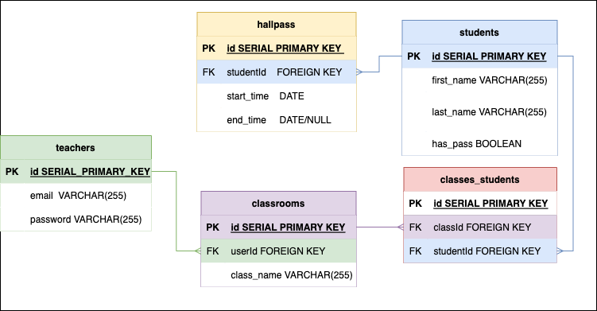

# Hall Pass

## Concept

*  After speaking with many teachers it seems that keeping track of which students are using the hallpass, and when each student is using a hallpass can quickly become a nightmare.  This HallPass app is here to help save some time and energy!  Each teacher will have access to each class they teach individually, as well as each student in those classes.  The teachers will be able to select a student in the class they're currently teaching to mark them as using the hall pass.  To reward the student for returning, they'll be given a dad joke!  The time each student spends with the hall pass will be logged for easy viewing.

## user stories

* As a teacher of many high school classes, i want an easy-to-use app to track which students are currently in the classroom and which are on a hall pass.

* As a teacher of many classes, i want to be able to pick one student and look at their hall pass history

## ERDs

## Routes

| Method | Path            | Purpose                                                             |
|--------|-----------------|---------------------------------------------------------------------|
| GET    | `/`             | Landing Page - Display landing and links to log in                  |
| GET    | `/classes`      | class page that lists all classes the user has access to            |
| POST   | `/classes`      | creates new class, redirects to `GET /classes`                      |
| GET    | `/classes/new`  | page that has form for creating new class                           |
| GET    | `/classes/:id`  | page that lists all students in a specific class                    |
| PATCH  | `/class/:id`    | page to update a pre-existing class, redirects to `get /class`      |
| GET    | `/students`     | page that lists all students                                        |
| POST   | `/students`     | creates new student, redirects to `GET /students`                   |
| GET    | `/students/new` | page that has form for creating new student                         |
| GET    | `/students/:id` | page to list details on specific student                            |
| PATCH  | `/students/:id` | page to update a pre-existing student, redirects to `GET /students` |
| DELETE | `/students/:id` | page to delete a specific student. redirects to `GET /students`     |
|        |                 |                                                                     |

## Wireframe

## MVP Goals

* Create website where teachers can store a classroom of students

* User ability to create new classrooms

* User ability to create new students

* User ability to delete classes

* Ability to check students in and out of classroom with a "hallpass"

* View each students hall pass usage

## Stretch Goals

* View details of students hall pass usage 

* Neat and clean styling 

* Ability for user to arrange students on `/classes/:id` page